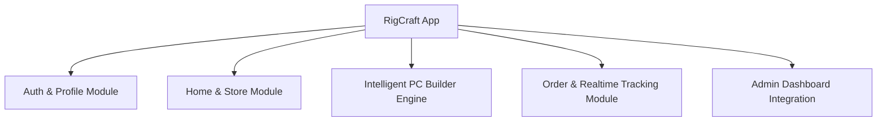

# 🖥️ RigCraft - Custom PC Builder & Hardware Store
## 🎓 বিশ্ববিদ্যালয়ের প্রজেক্ট ডিফেন্স ও প্রেজেন্টেশন গাইড (Project Report & Presentation Guide)

> **প্রজেক্টের নাম:** RigCraft (কাস্টম পিসি বিল্ডার ও অনলাইন হার্ডওয়্যার প্ল্যাটফর্ম)  
> **প্ল্যাটফর্ম:** ক্রস-প্ল্যাটফর্ম মোবাইল অ্যাপ্লিকেশন (Android / iOS / Web)  
> **টেকনোলজি স্ট্যাক:** Flutter, Dart, Firebase Authentication, Cloud Firestore  
> **আর্কিটেকচার:** MVP (Model-View-Presenter) + Reactive Stream-Based Architecture  

---

## 📑 সূচিপত্র (Table of Contents)
1. [প্রজেক্ট ওভারভিউ ও সমস্যা সমাধান (Project Overview & Problem Statement)](#1-প্রজেক্ট-ওভারভিউ-ও-সমস্যা-সমাধান)
2. [প্রধান ফিচার ও মডিউলসমূহ (Core Modules & Features)](#2-প্রধান-ফিচার-ও-মডিউলসমূহ)
3. [টেকনিক্যাল হাইলাইটস ও অ্যালগরিদম (Technical Highlights & Core Logic)](#3-টেকনিক্যাল-হাইলাইটস-ও-অ্যালগরিদম)
4. [সফটওয়্যার আর্কিটেকচার ও ডিজাইন প্যাটার্ন (Architecture & Design Pattern)](#4-সফটওয়্যার-আর্কিটেকচার-ও-ডিজাইন-প্যাটার্ন)
5. [ডাটাবেজ স্কিমা ও কালেকশনসমূহ (Database Schema - Firestore)](#5-ডাটাবেজ-স্কিমা-ও-কালেকশনসমূহ)
6. [অ্যাডমিন ড্যাশবোর্ড ইন্টিগ্রেশন (Admin Dashboard Integration)](#6-অ্যাডমিন-ড্যাশবোর্ড-ইন্টিগ্রেশন)
7. [স্যারের সামনে লাইভ ডেমো দেখানোর ধাপসমূহ (Step-by-Step Live Demo Flow)](#7-স্যারের-সামনে-লাইভ-ডেমো-দেখানোর-ধাপসমূহ)
8. [সম্ভাব্য ভাইভা প্রশ্ন ও আদর্শ উত্তর (Viva / Defense Q&A)](#8-সম্ভাব্য-ভাইভা-প্রশ্ন-ও-আদর্শ-উত্তর)

---

## 1. প্রজেক্ট ওভারভিউ ও সমস্যা সমাধান

### 💡 ব্যাকগ্রাউন্ড ও মূল সমস্যা:
সাধারণত ব্যবহারকারীরা যখন নিজের পছন্দমতো কাস্টম কম্পিউটার (PC) তৈরি করতে যান, তখন সবচেয়ে বড় সমস্যা হয় **হার্ডওয়্যার কম্প্যাটিবিলিটি (Hardware Compatibility)** নিয়ে। যেমন:
- ইন্টেলের মাদারবোর্ডে এএমডি (AMD) প্রসেসর বসবে কিনা?
- ডিডিআর৪ (DDR4) র‍্যাম ডিডিআর৫ (DDR5) মাদারবোর্ডে সাপোর্ট করবে কিনা?
- প্রসেসর ও গ্রাফিক্স কার্ডের মোট ওয়াট (Wattage) অনুযায়ী কত ওয়াটের পাওয়ার সাপ্লাই (PSU) প্রয়োজন?

অনভিজ্ঞ ক্রেতারা ভুল পার্টস অর্ডার করে আর্থিক ক্ষতির মুখে পড়েন। 

### 🎯 আমাদের সমাধান (RigCraft Solution):
**RigCraft** হলো একটি ইন্টেলিজেন্ট কাস্টম পিসি বিল্ডিং ও ই-কমার্স প্ল্যাটফর্ম। এর মধ্যে এমন একটি **অ্যালগরিদমিক ভ্যালিডেশন ইঞ্জিন** রয়েছে যা রিয়েল-টাইমে পার্টসের সকেট, র‍্যামের জেনারেশন এবং মোট পাওয়ার কনজাম্পশন ক্যালকুলেট করে স্বয়ংক্রিয়ভাবে ব্যবহারকারীকে সতর্ক করে দেয়। সাথে রয়েছে লাইভ ৬-ধাপের অর্ডার ট্র্যাকিং এবং ক্লাউডে পছন্দের পিসি কনফিগারেশন সেভ করার সুবিধা।

---

## 2. প্রধান ফিচার ও মডিউলসমূহ



### ১. অথেনটিকেশন ও প্রোফাইল মডিউল (Authentication & Profile)
- **Firebase Auth:** ইমেইল ও পাসওয়ার্ড দিয়ে সুরক্ষিত সাইন-আপ ও লগইন।
- **Persistent Login:** অ্যাপ বন্ধ করে পুনরায় ওপেন করলেও ব্যবহারকারীর সেশন স্বয়ংক্রিয়ভাবে সংরক্ষিত থাকে (Splash Screen চেক)।
- **User Profile & Cloud Saved Builds:** ব্যবহারকারীর নাম, ইমেইল, মোট অর্ডারের সংখ্যা এবং ক্লাউডে সেভ করা পিসি কনফিগারেশনের তালিকা।

### ২. হোম ও প্রি-বিল্ট পিসি স্টোর (Home & Catalog Store)
- **ব্যানার ও ক্যাটাগরি গ্রিড:** CPU, GPU, Motherboard, RAM ইত্যাদি ৮টি হার্ডওয়্যার ক্যাটাগরি।
- **Featured Pre-built Systems:** গেমিং ও প্রফেশনাল কাজের জন্য প্রস্তুত পিসির তালিকা ও স্পেসিফিকেশন।
- **One-Click Customize:** যেকোনো প্রি-বিল্ট পিসিকে ১ ক্লিকে কাস্টম বিল্ডারে লোড করে কম্পোনেন্ট অদলবদল (Customize) করার সুবিধা।
- **Trending Hardware:** রিয়েল-টাইমে Firestore থেকে আসা কম্পোনেন্ট ক্যাটালগ।

### ৩. ইন্টেলিজেন্ট কাস্টম পিসি বিল্ডার (Custom PC Builder Engine)
- ৮টি প্রয়োজনীয় স্লট: CPU, Motherboard, GPU, RAM, Storage, PSU, Cooler, Casing.
- **লাইভ বাজেট ক্যালকুলেটর:** প্রতিটি পার্টস যোগ বা বাদ দেওয়ার সাথে সাথে লাইভ মোট দাম আপডেট হয়।
- **লাইভ ওয়াট ক্যালকুলেটর:** সমস্ত পার্টসের ওয়াট যোগ করে সিস্টেমের প্রয়োজনীয় পাওয়ার প্রদর্শন করে।
- **কম্প্যাটিবিলিটি স্ট্যাটাস গার্ড:** পার্টসগুলোর মধ্যে অমিল থাকলে সাথে সাথে ওয়ার্নিং দেখায়।

### ৪. অর্ডার প্লেসমেন্ট ও লাইভ ৬-ধাপের ট্র্যাকিং (Orders & Tracking)
- কাস্টম বা প্রি-বিল্ট পিসির জন্য চেকআউট (ডেলিভারি ঠিকানা, ফোন নম্বর, ক্যাশ-অন-ডেলিভারি / অনলাইন পেমেন্ট)।
- প্রতিটি অর্ডারের জন্য ইউনিক ট্র্যাকিং আইডি জেনারেট হয় (যেমন: `RC-2026-XXXXXX`)।
- **৬-ধাপের লাইভ অ্যাসেম্বলি ট্র্যাকিং:**
  1. `Order Confirmed` (অর্ডার নিশ্চিতকরণ)
  2. `Parts Picked` (ওয়্যারহাউজ থেকে পার্টস সংগ্রহ)
  3. `Custom Assembly` (পিসি অ্যাসেম্বলি ও ক্যাবল ম্যানেজমেন্ট)
  4. `Stress Testing & QA` (থার্মাল ও বেঞ্চমার্ক টেস্ট)
  5. `Shipped & Dispatched` (কুরিয়ারে হস্তান্তর)
  6. `Delivered` (কাস্টমারের হাতে পৌঁছানো)

---

## 3. টেকনিক্যাল হাইলাইটস ও অ্যালগরিদম

### 🧠 কম্প্যাটিবিলিটি চেকিং অ্যালগরিদম (`custom_build_state.dart`):
আমাদের অ্যাপ্লিকেশনে একটি ডেডিকেটেড রুল-ইঞ্জিন কাজ করে:

```dart
// ১. সকেট ম্যাচিং (CPU vs Motherboard)
if (cpu.socket != null && motherboard.socket != null) {
  if (cpu.socket != motherboard.socket) {
    warnings.add("Socket mismatch: ${cpu.name} (${cpu.socket}) does not fit ${motherboard.name} (${motherboard.socket})");
  }
}

// ২. র‍্যাম জেনারেশন ভ্যালিডেশন (RAM vs Motherboard)
if (ram.memoryType != null && motherboard.memoryType != null) {
  if (ram.memoryType != motherboard.memoryType) {
    warnings.add("Memory generation mismatch: RAM is ${ram.memoryType} but Motherboard requires ${motherboard.memoryType}");
  }
}

// ৩. পাওয়ার সাপ্লাই ওয়াটেজ সেফটি চেক (PSU vs Total Estimated Wattage)
if (psu != null && psu.wattage < totalEstimatedWattage) {
  warnings.add("Insufficient PSU: Selected PSU provides ${psu.wattage}W, but system draws ~${totalEstimatedWattage}W. Recommend at least ${(totalEstimatedWattage * 1.2).toInt()}W");
}
```

---

## 4. সফটওয়্যার আর্কিটেকচার ও ডিজাইন প্যাটার্ন

### 🏗️ Model-View-Presenter (MVP) আর্কিটেকচার
প্রজেক্টে ক্লিন কোড এবং ইন্ডাস্ট্রি স্ট্যান্ডার্ড বজায় রাখতে **MVP প্যাটার্ন** ব্যবহার করা হয়েছে:
- **Model:** ডাটা স্ট্রাকচার ও সিরিয়ালাইজেশন (`PcComponent`, `PcBuildModel`, `OrderModel`, `UserModel`)।
- **View:** ইউজার ইন্টারফেস ও উইজেটস (`LoginView`, `HomeView`, `BuilderView`, `OrdersView`, `ProfileView`)। ভিউ কোনো বিজনেস লজিক হ্যান্ডেল করে না, শুধু প্রেজেন্টার থেকে প্রাপ্ত ফলাফল প্রদর্শন করে।
- **Presenter:** কন্ট্রাক্ট ইন্টারফেসের মাধ্যমে ভিউ এবং ব্যাকএন্ড সার্ভিসের মধ্যে সমন্বয় তৈরি করে (`LoginPresenter`, `SignUpPresenter`)।

### 🔄 স্টেট ম্যানেজমেন্ট ও রিয়েল-টাইম রিয়্যাক্টিভিটি
- **ChangeNotifier & ListenableBuilder:** কাস্টম বিল্ডারের তাৎক্ষণিক পার্টস নির্বাচন ও মূল্য গণনার জন্য স্টেট ম্যানেজমেন্ট।
- **Firestore Stream-based Listeners:** ক্লাউড ডাটাবেজের যেকোনো পরিবর্তনের সাথে সাথে মোবাইল স্ক্রিন স্বয়ংক্রিয়ভাবে রি-রেন্ডার হয় (`StreamBuilder` ও রিয়েল-টাইম স্ন্যাপশট)।
- **Offline & Safe Fallback:** ডাটাবেজ সাময়িকভাবে অফলাইনে থাকলেও বিল্ট-ইন ফলব্যাক ডেটার সাহায্যে অ্যাপ ক্র্যাশ করবে না।

---

## 5. ডাটাবেজ স্কিমা ও কালেকশনসমূহ

Firebase Cloud Firestore-এ ব্যবহৃত কালেকশনসমূহ:

| কালেকশন পাথ (Path) | বিবরণ (Description) | প্রধান ফিল্ডসমূহ (Fields) |
|---|---|---|
| `users/{uid}` | ব্যবহারকারীর তথ্য | `uid`, `name`, `email`, `role`, `createdAt` |
| `components/{id}` | হার্ডওয়্যার ক্যাটালগ | `name`, `category`, `brand`, `price`, `wattage`, `socket`, `memoryType`, `imageUrl`, `inStock` |
| `prebuilt_pcs/{id}` | প্রি-কনফিগারড পিসি | `title`, `tier`, `price`, `cpu`, `gpu`, `ram`, `storage`, `totalWattage`, `imageUrl` |
| `orders/{id}` | কাস্টমার অর্ডার ও ট্র্যাকিং | `userId`, `items[]`, `totalAmount`, `status`, `trackingNumber`, `orderDate`, `shippingAddress` |
| `users/{uid}/saved_builds/{id}` | ক্লাউড সেভড রিগস | `title`, `components[]`, `price`, `totalWattage`, `savedAt` |

---

## 6. অ্যাডমিন ড্যাশবোর্ড ইন্টিগ্রেশন

অ্যাডমিন প্যানেল (`elahi-dashboard-admin`) এবং এই মোবাইল অ্যাপ একই Firebase প্রজেক্ট শেয়ার করে:
1. **প্রোডাক্ট ম্যানেজমেন্ট:** অ্যাডমিন নতুন কম্পোনেন্ট বা পিসি যোগ/আপডেট করলে তা মুহূর্তে কাস্টমার অ্যাপের হোম ও বিল্ডারে চলে আসে।
2. **অর্ডার প্রসেসিং:** অ্যাডমিন যখন ড্যাশবোর্ড থেকে অর্ডারের স্ট্যাটাস পরিবর্তন করেন (যেমন: `confirmed` ➔ `assembly` ➔ `shipped`), কাস্টমারের অ্যাপে কোনো রিফ্রেশ ছাড়াই ৬-স্টেপ ট্র্যাকার লাইভ সামনে এগিয়ে যায়।

---

## 7. স্যারের সামনে লাইভ ডেমো দেখানোর ধাপসমূহ

প্রেজেন্টেশনে স্যারকে অ্যাপটি যেভাবে ক্রমানুসারে দেখাবেন:

1. **ধাপ ১: স্প্ল্যাশ ও অথেনটিকেশন (Splash & Login)**
   - অ্যাপ ওপেন করে স্প্ল্যাশ অ্যানিমেশন দেখান।
   - লগইন পেজে গিয়ে এক ক্লিকে **"⚡ Autofill Demo Account"** বাটন চাপুন এবং সাইন-ইন করুন।
2. **ধাপ ২: হোম স্ক্রিন ও প্রি-বিল্ট ক্যাটালগ (Home Store)**
   - ট্রেন্ডিং হার্ডওয়্যার এবং প্রি-বিল্ট গেমিং পিসিগুলো দেখান।
   - যেকোনো একটি প্রি-বিল্ট পিসি ওপেন করে **"Customize"** বাটনে ক্লিক করুন।
3. **ধাপ ৩: কাস্টম পিসি বিল্ডার ও ইন্টেলিজেন্ট ভ্যালিডেশন (Core Attraction)**
   - দেখান কীভাবে একটি এএমডি প্রসেসরের সাথে একটি ইনটেল মাদারবোর্ড চয়েস করলে সাথে সাথে স্ক্রিনে **"Socket Mismatch Warning"** চলে আসে।
   - সঠিক পার্টস সিলেক্ট করে দেখান কীভাবে লাইভ ওয়াট ও দাম স্বয়ংক্রিয়ভাবে ক্যালকুলেট হচ্ছে।
4. **ধাপ ৪: ক্লাউড সেভ ও অর্ডার প্লেসমেন্ট (Save Rig & Checkout)**
   - **"Save Rig"** চাপলে পিসি কনফিগারেশনটি ক্লাউডে ইউজারের প্রোফাইলে সেভ হয়ে যায়।
   - **"Order Custom Rig"** চেপে ডেলিভারি তথ্য দিয়ে অর্ডার কনফার্ম করুন।
5. **ধাপ ৫: লাইভ ট্র্যাকিং ও প্রোফাইল (Live Orders & Profile)**
   - Orders ট্যাবে গিয়ে লাইভ ৬-স্টেপ ট্র্যাকিং বারটি দেখান।
   - প্রোফাইল ট্যাবে গিয়ে সেভ করা বিল্ড লোড করে পুনরায় বিল্ডারে নিয়ে আসা দেখান।

---

## 8. সম্ভাব্য ভাইভা প্রশ্ন ও আদর্শ উত্তর

#### ❓ প্রশ্ন ১: প্রজেক্টটিতে কেন Flutter ব্যবহার করলেন?
> **উত্তর:** Flutter দিয়ে একক কোডবেস (Single Codebase) থেকে একই সাথে আকর্ষণীয় UI সহ হাই-পারফরম্যান্স Android ও iOS অ্যাপ তৈরি করা যায়। এছাড়া Flutter-এর রিঅ্যাক্টিভ ফ্রেমওয়ার্ক এবং রিচ উইজেট লাইব্রেরি রিয়েল-টাইম কাস্টম পিসি বিল্ডারের মতো ইন্টারেক্টিভ ইন্টারফেস বানানোর জন্য আদর্শ।

#### ❓ প্রশ্ন ২: পিসির পার্টস কম্প্যাটিবিলিটি কীভাবে চেক করেছেন?
> **উত্তর:** আমরা `CustomBuildState` ক্লাসের মধ্যে একটি ডেডিকেটেড ভ্যালিডেশন লজিক লিখেছি। যখনই ব্যবহারকারী কোনো কম্পোনেন্ট সিলেক্ট বা পরিবর্তন করেন, লজিকটি নির্বাচিত CPU এবং Motherboard-এর `socket` প্রোপার্টি, RAM ও Motherboard-এর `memoryType` (DDR4/DDR5) এবং গ্রাফিক্স কার্ড ও প্রসেসরের সম্মিলিত ওয়াটেজ ক্যালকুলেট করে PSU-এর সাথে তুলনা করে। অমিল হলে স্বয়ংক্রিয়ভাবে রিয়েল-টাইম সতর্কতা জারি করে।

#### ❓ প্রশ্ন ৩: Firebase-এর কোন কোন সার্ভিস ব্যবহার করেছেন এবং কেন?
> **উত্তর:** আমরা দুইটি মূল সার্ভিস ব্যবহার করেছি:
> ১. **Firebase Authentication:** সুরক্ষিত ইউজার সাইন-আপ ও টোকেন-বেসড সেশন ম্যানেজমেন্টের জন্য।
> ২. **Cloud Firestore:** নো-সিক্যুয়েল (NoSQL) রিয়েল-টাইম ক্লাউড ডাটাবেজ। এর `Stream` লিসেনারের মাধ্যমে অ্যাডমিন ড্যাশবোর্ডে ডাটা আপডেট হওয়ার সাথে সাথে কোনো ম্যানুয়াল রিফ্রেশ ছাড়াই অ্যাপে লাইভ ডাটা ও অর্ডার স্ট্যাটাস আপডেট হয়ে যায়।

#### ❓ প্রশ্ন ৪: অ্যাপটিতে কোন আর্কিটেকচারাল প্যাটার্ন অনুসরণ করা হয়েছে?
> **উত্তর:** আমরা **MVP (Model-View-Presenter)** প্যাটার্ন অনুসরণ করেছি। এর ফলে আমাদের ইউজার ইন্টারফেস (View) এবং ডেটা/বিজনেস লজিক (Presenter & Service) সম্পূর্ণ আলাদা থাকে। এটি কোডের রিইউজেবিলিটি ও টেস্টেবিলিটি বৃদ্ধি করে।

#### ❓ প্রশ্ন ৫: অফলাইনে বা ডাটাবেজ সংযোগে সমস্যা হলে অ্যাপ কীভাবে হ্যান্ডেল করে?
> **উত্তর:** আমাদের `FirestoreService`-এ সম্পূর্ণ সেফ-ফলব্যাক এবং এক্সেপশন হ্যান্ডলিং মেকানিজম রয়েছে। ক্লাউড কানেকশন সাময়িকভাবে অনুপস্থিত থাকলেও অ্যাপটি লোকাল ক্যাশড ডাটা দিয়ে নিরবচ্ছিন্নভাবে চলবে, ক্র্যাশ করবে না।

---
*প্রস্তুতকারক: বিশ্ববিদ্যালয়ের ফাইনাল ইয়ার / সেমিস্টার প্রজেক্ট প্রেজেন্টেশনের জন্য বিশেষায়িত।*
