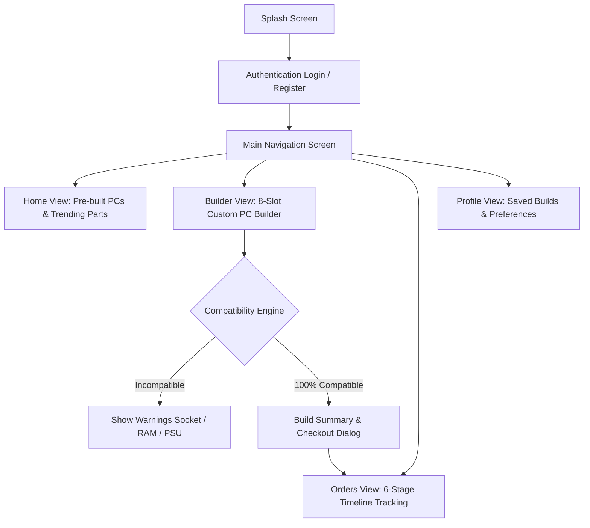

# 🖥️ প্রজেক্ট ডকুমেন্টেশন: RigCraft – Custom PC Builder & Hardware Store

---

## ১. প্রজেক্ট পরিচিতি (Project Overview)
**RigCraft** হলো একটি ক্রস-প্ল্যাটফর্ম (Android, Web, Desktop) আধুনিক ফ্ল্যাটার অ্যাপ্লিকেশন। এর মূল উদ্দেশ্য হলো কম্পিউটার ব্যবহারকারী, গেমার, কন্টেন্ট ক্রিয়েটর এবং শিক্ষার্থী/প্রফেশনালদের জন্য একটি স্বয়ংক্রিয় এবং বুদ্ধিমান **কাস্টম পিসি বিল্ডিং ও ই-কমার্স সমাধান** প্রদান করা।

সাধারণ ক্রেতারা যখন নিজের জন্য একটি ডেস্কটপ পিসি তৈরি করতে চান, তখন হার্ডওয়্যারের সামঞ্জস্যতা (Compatibility) যেমন—প্রসেসরের সাথে মাদারবোর্ডের সকেট মিলবে কি না, মাদারবোর্ডের সাথে র‍্যাম DDR4 নাকি DDR5 লাগবে, কিংবা প্রয়োজনীয় পাওয়ার সাপ্লাই (PSU) কত ওয়াটের হতে হবে—তা নিয়ে দ্বিধাদ্বন্দ্বে পড়েন। **RigCraft** অ্যাপটি রিয়েল-টাইম কম্প্যাটিবিলিটি এলগরিদম এবং পাওয়ার ওয়াটেজ ক্যালকুলেটরের মাধ্যমে স্বয়ংক্রিয়ভাবে নিশ্চিত করে যেন ব্যবহারকারী শতভাগ নির্ভুল পিসি বিল্ড করতে পারেন।

---

## ২. প্রজেক্টের মূল উদ্দেশ্য (Project Objectives)
1. **স্মার্ট কম্পোনেন্ট ম্যাচিং (Smart Hardware Matching):** ব্যবহারকারী যেন কোনো ভুল বা অসামঞ্জস্যপূর্ণ হার্ডওয়্যার নির্বাচন না করে তা স্বয়ংক্রিয়ভাবে সতর্ক করা।
2. **ধাপে ধাপে পিসি কনফিগারেশন:** ৮টি মূল ক্যাটাগরিতে (CPU, GPU, Motherboard, RAM, Storage, PSU, Cooler, Casing) সহজ ও আকর্ষণীয় ইন্টারফেসে পার্টস বাছাই করার সুযোগ।
3. **রেডিমেড প্রি-বিল্ট পিসি এক্সপ্লোর ও কাস্টমাইজেশন:** অভিজ্ঞ হার্ডওয়্যার ইঞ্জিনিয়ারদের সাজানো গেমিং ও ওয়ার্কস্টেশন পিসি এক ক্লিকে দেখা এবং নিজের পছন্দমতো মডিফাই করে অর্ডার করা।
4. **অর্ডার টাইমলাইন ট্র্যাকিং:** পিসি অর্ডার করার পর পার্টস নির্বাচন, অ্যাসেম্বলি, ২৪ ঘণ্টার স্ট্রেস টেস্টিং থেকে শুরু করে হোম ডেলিভারি পর্যন্ত প্রতিটি ধাপের লাইভ স্ট্যাটাস দেখা।

---

## ৩. প্রযুক্তি ও আর্কিটেকচার (Technology Stack & Architecture)
* **মূল ফ্রেমওয়ার্ক:** Flutter (Dart SDK `>=3.0.0 <4.0.0`)
* **ডিজাইন প্যাটার্ন:** **MVP (Model-View-Presenter)** এবং রিঅ্যাক্টিভ স্টেট ম্যানেজমেন্টের জন্য `ChangeNotifier` ও `ListenableBuilder`।
* **ইউজার ইন্টারফেস:** Modern Material 3 Design, Custom Dark & Light Accents, Glassmorphism, Google Fonts।
* **সাপোর্টেড প্ল্যাটফর্ম:** Android (APK Built), Web (Google Chrome / Edge), Windows Desktop।

---

## ৪. অ্যাপ্লিকেশনের মূল ফিচারসমূহ (Key Features & Functionalities)

### 🛠️ ১. ইন্টেলিজেন্ট কাস্টম পিসি বিল্ডার (Custom PC Builder)
* **৮টি আবশ্যিক স্লট:**
  - Processor (CPU)
  - Motherboard
  - Graphics Card (GPU)
  - Memory (RAM)
  - Storage (NVMe SSD / HDD)
  - Power Supply (PSU)
  - CPU Cooler (Air / Liquid AIO)
  - Casing / Chassis
* **লাইভ প্রোগ্রেস ও বাজেট ক্যালকুলেটর:** কয়টি পার্টস যুক্ত হয়েছে (যেমন: `5 of 8 parts configured`) এবং মোট কত খরচ হচ্ছে তা প্রতি ক্লিকে লাইভ আপডেট হয়।
* **রিসেট ও সেভ ড্রাফট:** যেকোনো সময় বিল্ড রিসেট করা বা ভবিষ্যতের জন্য প্রোফাইলে সেভ করে রাখার ব্যবস্থা।

### ⚡ ২. অটোমেটিক কম্প্যাটিবিলিটি ও ওয়াটেজ ক্যালকুলেশন ইঞ্জিন
* **Socket Compatibility Check:** যেমন—AMD Ryzen AM5 প্রসেসরের সাথে Intel LGA1700 মাদারবোর্ড নির্বাচন করলে সিস্টেম স্বয়ংক্রিয় লাল সতর্কবার্তা দেবে।
* **RAM Generation Check:** নির্বাচিত মাদারবোর্ড যদি DDR5 সাপোর্টেড হয়, তবে DDR4 র‍্যাম নির্বাচন করলে সতর্ক করবে।
* **Dynamic Wattage Calculator & PSU Guard:** প্রতিটি উপাদানের সর্বোচ্চ পাওয়ার ড্র (TDP) হিসেব করে মোট ওয়াটেজ বের করে এবং পাওয়ার সাপ্লাই পর্যাপ্ত না হলে সতর্কবার্তা প্রদর্শন করে।

### 🛒 ৩. প্রি-বিল্ট পিসি শপ ও এক্সপ্লোরার (Pre-built PC Store)
* **ক্যাটাগরি ভিত্তিক ভিউ:** Ultimate Gaming, Pro Workstation, Creator Edition, Budget Beast ইত্যাদি।
* **ডিসকাউন্ট ও অফার ক্যালকুলেশন:** অরিজিনাল প্রাইস এবং ডিসকাউন্টেড প্রাইসের পার্থক্য ও পারসেন্টেজ সরাসরি প্রদর্শন।
* **"Customize this Build" বাটন:** রেডিমেড পিসির সবগুলো পার্টস সরাসরি কাস্টম বিল্ডারে স্থানান্তর করে পছন্দমতো আপগ্রেড করার ফিচার।

### 📋 ৪. অর্ডার ম্যানেজমেন্ট ও ৬-স্টেপ অ্যাসেম্বলি ট্র্যাকিং
অর্ডার করার পর গ্রাহক ইন্টারেক্টিভ স্টেপারের মাধ্যমে পুরো প্রসেস পর্যবেক্ষণ করতে পারে:
1. **Order Confirmed** – অর্ডার সফলভাবে সিস্টেম ভেরিফাই করেছে।
2. **Parts Picked & Verified** – গুদাম থেকে অথেনটিক পার্টস সংগ্রহ ও সিরিয়াল নম্বর মেলানো হয়েছে।
3. **Custom Assembly & Wiring** – অভিজ্ঞ টেকনিশিয়ান দ্বারা নিখুঁত কেবল ম্যানেজমেন্ট সহ পিসি তৈরি।
4. **BIOS & 24h Stress Testing** – থার্মাল ও হার্ডওয়্যার স্ট্যাবিলিটি নিশ্চিত করতে ২৪ ঘণ্টা ফুল লোড টেস্ট।
5. **Shipped with Express Courier** – প্রিমিয়াম শকপ্রুফ প্যাকেজিং সহ কুরিয়ারে হস্তান্তর।
6. **Delivered & Completed** – গ্রাহকের ঠিকানায় অক্ষত অবস্থায় ডেলিভারি সম্পন্ন।

### 👤 ৫. ইউজার প্রোফাইল ও সেটিংস
* গ্রাহকের প্রোফাইল তথ্য ও ব্যাজ।
* অতীতে সেভ করে রাখা পিসি কনফিগারেশনের তালিকা এবং এক ক্লিকে পুনরায় লোড করার সুযোগ।
* ডার্ক মোড, হেল্প সেন্টার এবং লগআউট সুবিধা।

---

## ৫. সিস্টেম ওয়ার্কফ্লো (System Workflow)



---

## ৬. মডিউল ও সোর্স কোড আর্কিটেকচার (Code Architecture)

```
lib/
├── core/
│   ├── constants/        # AppColors, AppStrings, AppData (Mock Hardware Data)
│   ├── theme/            # AppTheme (Light & Modern Typography)
│   └── widgets/          # Reusable UI (AppNetworkImage, SpecChip, LiveBadge)
├── models/
│   ├── pc_component_model.dart  # Component attributes, sockets, wattage, prices
│   ├── pc_build_model.dart      # Pre-built configurations & discounts
│   ├── custom_build_state.dart  # Real-time state, compatibility & wattage logic
│   ├── order_model.dart         # Order tracking status & invoice items
│   └── user_model.dart          # Customer profile data
├── presenters/
│   └── login_presenter.dart     # MVP Login logic & credential validation
├── services/
│   └── auth_service.dart        # Authentication Service
└── views/
    ├── splash/                  # Animated branding entry view
    ├── auth/                    # Login & Sign-up views
    ├── home/                    # Storefront & PC Details view
    ├── builder/                 # Custom builder, Picker Sheet, Summary Dialog
    ├── orders/                  # Orders List & Step-by-step Tracking Sheet
    ├── profile/                 # Profile & Saved Builds Manager
    └── main_nav_view.dart       # Bottom Navigation Controller
```

---

## ৭. উপসংহার ও ভবিষ্যৎ পরিকল্পনা (Conclusion & Future Improvements)
**RigCraft** একটি বাস্তবমুখী এবং ব্যবহারকারী-বান্ধব ফ্ল্যাটার অ্যাপ্লিকেশন যা জটিল হার্ডওয়্যার কেনার সিদ্ধান্তকে একদম সহজ এবং নির্ভরযোগ্য করে তোলে।

**ভবিষ্যৎ সংযোজনসমূহ:**
* লাইভ ক্লাউড ডাটাবেস (Firebase Firestore) ও রিয়েল-টাইম পুশ নোটিফিকেশন।
* অনলাইন পেমেন্ট গেটওয়ে ইন্টিগ্রেশন (bKash, Nagad, SSLCommerz)।
* কৃত্রিম বুদ্ধিমত্তা (AI Assistant) ভিত্তিক স্বয়ংক্রিয় পিসি সাজেস্টর (নির্দিষ্ট বাজেট বা গেমিং রিকোয়ারমেন্ট দিলে স্বয়ংক্রিয় বিল্ড তৈরি করে দেওয়া)।
